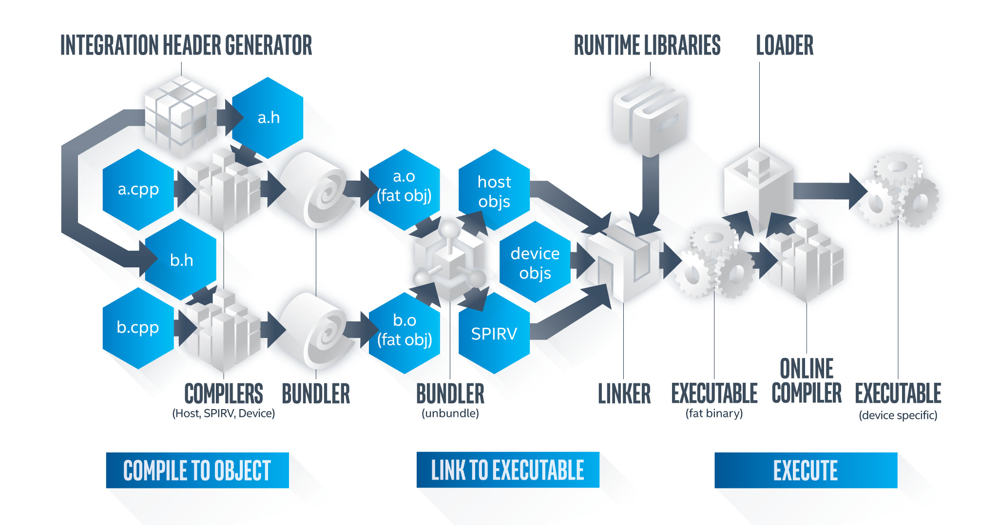

.. _compilation-model:

Compilation Model
=================

The command used to compile a program employing the oneAPI programming
model is very similar to standard C/C++ compilation with standard
compile and link steps. However, the compilation model supports code
that executes on both a host and potentially several accelerators
simultaneously. Thus, the commands issued by the compiler, linker, and
other supporting tools as a result of compile and link steps are more
complicated than standard C/C++ compilation targeting one architecture.
The developer is protected from this complexity; however advanced users
of the tools may want to understand these details to better target
specific architectures.

A DPC++ program can consist of a set of source files, where each may
have both host and device code. Compilation of the host code is somewhat
straightforward as the target architecture is known. Typically, the host
is an x86-based computer.

By default, the Intel oneAPI DPC++ Compiler compiles device code into a
device-agnostic form that can run on any compatible devices. This is
known as online compilation because the device-agnostic code gets
compiled into a device-specific form at runtime, or when “online.”
Additionally, DPC++ allows production of device-specific code at compile
time. This process is known as offline compilation. Offline compilation
for devices presents several challenges because of the need to target
several architectures, some known and some unknown at the time of
compilation. In addition, it may be helpful to apply aggressive
optimization to a specific target. The compilation model supports these
different needs. The compilation model enables:

-  Target specific code - Target specific versions of a kernel function
-  Target specific optimization – Compiler optimization for a specific
   target
-  General target support – Target a broad set of architectures
-  Future target support - Target a new architecture. This could be the
   case in forward compatibility cases where a new architecture provides
   new optimization opportunities.

To support these needs, the code can be compiled into two main forms – a
`SPIR-V <glossary.html>`__
intermediate representation, which is the device-agnostic form, and
target specific executable code.

-  The SPIR-V representation enables online compilation, which is
   compilation to device code at execution time.
-  Compilation to target specific executable code before executing the
   application is termed offline compilation. The Intel oneAPI DPC++
   Compiler creates multiple code forms for each device.

These two forms are bundled together in an application binary known as a
`fat
binary <glossary.html>`__.
The fat binary is employed by the oneAPI runtime when the application
executed and form needed for the target device is determined at runtime.
Device code for multiple devices co-exists in a single fat binary.

The following figure illustrates the compilation process from source
code to fat binary.

| 
| |image0|

The tools participating in the compilation are represented by rectangles
in the figure and are described as follows:

-  **Driver** – The executable name is ``dpcpp`` on Linux\* and
   ``dpcpp-cl`` on Windows*. Invoke this file on the command line to
   start compilation. It orchestrates the compilation process and
   invokes other tools as needed.
-  **Host compiler** – the DPC++ host compiler. It is possible to employ
   a third-party host compiler by invoking the tools manually.
-  **Device compiler** – a DPC++ device compiler (there can be more than
   one), SPIR-V compiler by default. The output files have the extension
   ``*.bc``. SPIR-V is produced after the device code linkage step.
-  **SPIRV compiler** - **llvm-spirv** – standard LLVM tool distributed
   with the Intel® oneAPI Base Toolkit that converts LLVM IR bitcode to
   SPIR-V.
-  **Bundler** – Marshalls host and device object code into a single
   file called a fat object.
-  **Unbundler** – Unmarshalls fat objects back into their constituent
   host and device object code. It is a part of the bundler.
-  **LLVM bitcode linker** – standard LLVM tool distributed with the
   Intel® oneAPI Base Toolkit that links LLVM IR bitcode files.
-  **<Target> Back End** – a back end for the target <Target> used in
   the offline compilation scenario. Compiles SPIR-V to native device
   code form.
-  **Platform linker** – the standard linker on the development platform
   – ``ld`` on Linux and ``link.exe`` on Windows.
-  **Offload wrapper** - wraps device binaries (different from device
   object files) into a host object file linked with the final DPC++
   executable (fat binary)

File Types:

-  **Device object file** - device object code suitable for further
   linkage with other device objects. Can be LLVM bitcode or some native
   ISA.
-  **Host object file** - usual object file containing host object code.
   Examples include COFF on Windows or ELF on Linux.
-  **Fat object file** - a host object format file containing host and
   device code compiled for all targets passed via ``-fsycl-targets``.
   Device code is inserted into special object file sections.
-  **Fat binary file** - a host executable containing device binaries -
   either in SPIR-V or other form.

The compilation is a three-step process:

#. Compile to Object – The source code in the files ``a.cpp`` and
   ``b.cpp`` is parsed into an intermediate representation.
   Optimizations are invoked on the intermediate representation. The
   compiler command line specifies a list of targets for device object
   code generation or the default SPIR-V can be used. These objects are
   bundled together into a fat object. Two fat objects are produced -
   ``a.o`` and ``b.o`` (``a.obj`` and ``b.obj`` on Windows)
#. Link to Executable – The fat objects are unbundled and linked
   together into a target specific image and a generic image. Additional
   optimizations may be invoked during this phase. The target specific
   image and generic image are grouped together into a fat binary.
#. Execute – The fat binary is loaded for execution. Once the program
   control flow arrives to the place where DPC++ kernel offload is
   invoked, the oneAPI runtime is called to determine if a target
   specific executable image exists. If it does, execution proceeds with
   the target specific executable image. If it does not, the generic
   image is loaded, then compiled online to produce the target specific
   image, then proceeds with the execution. If neither of the two exist,
   then the kernel executes on the host. Execution of the user
   application portion of the fat binary proceeds.

The starting point for any compilation involves the invocation of the
compiler driver, ``dpcpp``. The following compilation command compiles
two source files, ``a.cpp`` and ``b.cpp``, compiles, and links them into
an executable:

::

   dpcpp a.cpp b.cpp

This is the simplest compilation scenario where compilation and linkage
are done in one step and the device code is delivered in device-agnostic
form. More complex scenarios are described later.

.. toctree::
   :maxdepth: 4

   
   compile-to-object-step
   link-to-executable-step
   execute-step
   online-compilation