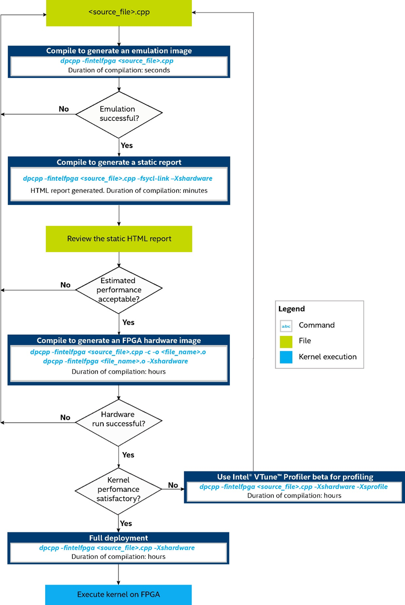

.. _fpga-flow:

FPGA Flow
=========

Field-programmable gate arrays (FPGAs) are integrated circuits that can
be configured repeatedly to perform an infinite number of functions.

The key benefit of using FPGAs for algorithm acceleration is that they
support wide, heterogeneous, and unique pipeline implementations. This
characteristic contrasts with many different types of processing units
such as symmetric multiprocessors, digital signal processors (a
special-purpose processor), and graphics processing units (GPUs). In
these types of devices, parallelism is achieved by replicating the same
generic computation hardware multiple times.

For general Intel oneAPI DPC++ Compiler use, FPGA compilation, or design
flow of device-specific code is special in the following ways:

-  FPGAs support only the offline compilation mode and provide two
   device compilation stages to help iterate on a program. For more
   information, see `FPGA Offline
   Compilation <offline-compilation-for-fpga.html>`__.
-  FPGA devices support two image types, each serving a different
   purpose. For more information, see `FPGA Device Image
   Types <offline-compilation-for-fpga.html>`__.

The following diagram shows a typical compilation flow for FPGA devices.

| 
| |image0|

The emulation image verifies the code correctness and only takes seconds
to complete. This is the recommended first step in compiling code. Next,
the static report helps determine whether the estimated kernel
performance data is acceptable. After generating a hardware image, use
Intel® VTune™ Profiler to collect key profiling data from hardware runs.

For information about emulation and hardware images, see `FPGA Device
Image
Types <offline-compilation-for-fpga.html>`__.
For more information about the static report or collecting profiling
data, see the `Intel oneAPI DPC++ FPGA Optimization
Guide <https://software.intel.com/en-us/download/oneapi-fpga-optimization-guide>`__.

.. toctree::
   :maxdepth: 4

   
   example-fpga-commands
   offline-compilation-for-fpga
   targeting-multiple-fpgas
   other-supported-intel-oneapi-dpcpp-compiler-options-for-fpga
   fpga-device-selection-in-the-host-code
   host-and-kernel-interaction-on-fpga
   fpga-workflows-in-ides