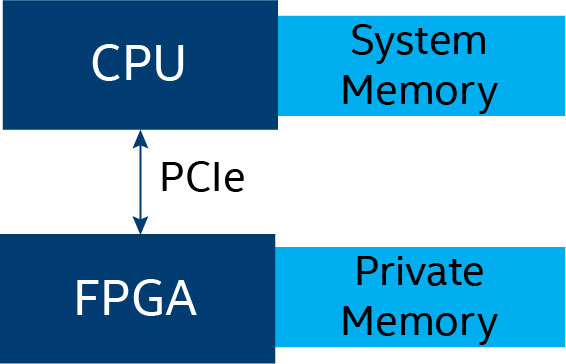

.. _host-and-kernel-interaction-on-fpga:

Host and Kernel Interaction on FPGA
===================================

FPGA devices typically communicate with the host (CPU) via I/O, such as
PCIe.

|image0|

A PCIe-connected FPGA typically has its own private DDR on which it
primarily operates. Prior to executing a kernel on the FPGA
reconfigurable logic, the CPU must first bulk transfer (over dynamic
memory access (DMA)) all data that the kernel needs to access into the
FPGA’s local DDR memory. When the kernel completes its operations, it
must transfer the results over DMA back to the CPU. The transfer speed
is bound by the PCIe link itself and the efficiency of the DMA solution,
for example, on the Intel® Arria® 10 programmable acceleration card
(PAC), which has a PCIe Gen 3 x 8 link, transfers are typically 6 to 7
GB/s. For more information, refer to the `Intel oneAPI DPC++ FPGA
Optimization
Guide <https://software.intel.com/en-us/download/oneapi-fpga-optimization-guide>`__,
which highlights techniques for eliminating unnecessary transfers (for
example, by correctly tagging read-only or write-only data).

Further, improve system efficiency by maximizing the number of
concurrent operations. For example, because PCIe supports simultaneous
transfers in opposite directions and PCIe transfers do not interfere
with kernel execution, aim to have device-to-host transfers,
host-to-device transfers, and kernel executions all executing
simultaneously to maximize FPGA device utilization. For more
information, refer to the Intel oneAPI DPC++ FPGA Optimization Guide,
which describes techniques, such as double buffering, to help improve
system efficiency.

Configuring the FPGA reconfigurable logic is a lengthy operation
requiring several seconds of communication with the FPGA device. The
runtime automatically manages this configuration, which might occur when
a kernel launches at initialization, or might not occur if the same
programming file has already been loaded onto the device. To manage this
variability and when measuring performance, perform a warm-up that
executes one kernel prior to taking any time measurements in a program.

Kernels on an FPGA consume reconfigurable logic and can service only one
invocation of that kernel at a time. A program that launches multiple
invocations of the same kernel instance requires the runtime to execute
those invocations sequentially on the same kernel logic.

For more information, see:

-  `Intel oneAPI DPC++ FPGA Optimization
   Guide <https://software.intel.com/en-us/download/oneapi-fpga-optimization-guide>`__
-  `Intel® oneAPI DPC++ FPGA Workflows on Third-Party
   IDEs <https://software.intel.com/en-us/articles/intel-oneapi-dpcpp-fpga-workflow-on-ide>`__
-  https://www.intel.com/content/www/us/en/programmable/products/boards_and_kits/dev-kits/altera/acceleration-card-arria-10-gx/overview.html
-  https://en.wikipedia.org/wiki/Direct_memory_access
-  https://en.wikipedia.org/wiki/PCI_Express
-  https://en.wikipedia.org/wiki/DDR4_SDRAM

