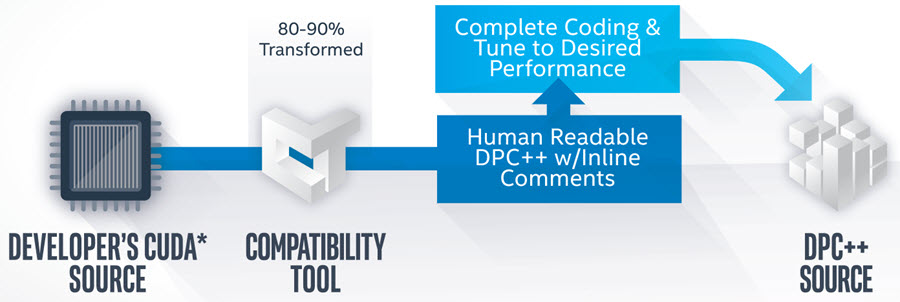
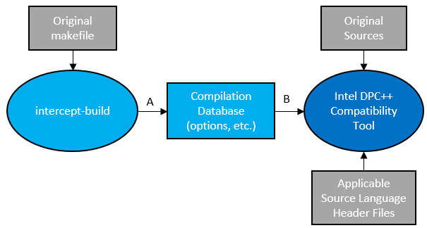

.. _migrating-from-cuda-to-dpcpp:

Migrating from CUDA\* to DPC++
==============================

The Intel DPC++ Compatibility Tool is part of the Intel oneAPI Base
Toolkit. The goal of this tool is to assist developers employing
NVIDIA\* CUDA or other languages in the future to migrate their
applications to benefit from DPC++. This tool generates DPC++ code as
much as possible. However, depending on the complexity of the code, it
will not migrate all code and manual changes may be required. The tool
provides help with IDE plug-ins, a user guide, and embedded comments in
the code to complete the migration to DPC++.

.. container:: section
   :name: GUID-76E6411F-B513-44C3-893B-9DB042FEC095

   .. rubric:: Source File Workflow
      :class: sectiontitle

   The following workflow uses a command line with multiple source
   files:

   | 
   | |image0|

   #. Run the Intel DPC++ Compatibility Tool using the following inputs:

      -  Original source code
      -  Options, macros, and settings
      -  Applicable source language header files, including header files
         for the libraries used in the sources

      Command line example for the Intel DPC++ Compatibility Tool:

      ::

         dpct --in-root=./foo --out-root=./result ./foo/main.cu ./foo/bar/util.cu --extra-arg="-I./foo/bar/"

   #. After the DPC++ code is output, identify any areas that require
      additional attention with the help of embedded comments and modify
      the code to create the final DPC++ code.

.. container:: section
   :name: GUID-F30708E8-EC3C-4494-AD08-1DB368A5AAEA

   .. rubric:: Makefile Workflow
      :class: sectiontitle

   The following workflow uses a command line with a makefile project:

   | 
   | |image1|

   Command line example for intercept-build (A):

   ::

      intercept-build make 

   Command line example for Intel DPC++ Compatibility Tool (B):

   ::

      dpct -p compile_commands.json --in-root=../.. --out-root=output program.cu

   Additional information is available from `Get Started with the Intel®
   DPC++ Compatibility
   Tool <https://software.intel.com/en-us/get-started-with-intel-dpcpp-compatibility-tool>`__
   and the `Intel® DPC++ Compatibility Tool User
   Guide <https://software.intel.com/en-us/intel-dpcpp-compatibility-tool-user-guide>`__.

