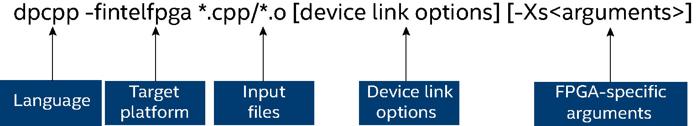

.. _offline-compilation-for-fpga:

Offline Compilation for FPGA
============================

.. container:: Note

   .. rubric:: Note
      :class: NoteTipHead

   FPGA devices do not support online compilation.

.. container:: Note

   .. rubric:: Note
      :class: NoteTipHead

   While all compilation flows (emulation, report, and hardware) are
   supported on Linux, only the emulation flow is supported on Windows.

As shown in the previous figure, when targeting an FPGA device, an FPGA
target compiler is injected into the device generation phase.

-  In the first FPGA compilation stage, the FPGA target compiler
   synthesizes the high-level DPC++ code to RTL-level design
   abstraction. This process usually takes minutes to complete. At the
   end of this stage, the compiler generates a high-level design HTML
   report that contains most of the information required to analyze and
   iterate the design.
-  In the second FPGA compilation stage, the FPGA target compiler
   analyzes and synthesizes the RTL-level design abstraction to an FPGA
   configuration bitstream. This process takes a long time (usually in
   hours) to complete. View accurate FPGA frequency and resource
   utilization results after this process completes.

The most common case for FPGA compilation is targeting a single device.
Use the following syntax for compiling an FPGA device:

| 
| |image0|

.. container:: Note

   .. rubric:: Note
      :class: NoteTipHead

   On Windows 7 or Windows 8.1 systems, ensure that the combined length
   of the source or output file name and the corresponding file path
   does not exceed 260 characters. If the combined length of the source
   or output file name and its file path exceeds 260 characters, the
   offline compiler generates the following error message:
   ``Error: failed to move <work_directory> to <project_directory>``
   where ``<work_directory>`` is used for compilation and
   ``<project_directory>`` is the folder storing the reports and FPGA
   related files generated during the compilation. Windows 10 systems do
   not have the 260-character path limit.

Examples:

-  Use the following command to compile for emulation:

   ::

      dpcpp -fintelfpga *.cpp 

   .. container:: Note

      .. rubric:: Note
         :class: NoteTipHead

      Remove the project directory ``<file_name>.proj`` (if it exists)
      before executing the offline compilation command, where
      ``<file_name>`` is the name of output binary executable name.

-  Linux only: Use the following command to generate the high-level
   design report:

   ::

      dpcpp -fintelfpga *.cpp -fsycl-link -Xshardware

-  Linux only: Use the following command to compile for hardware:

   ::

      dpcpp –fintelfpga *.cpp -c 
      dpcpp –fintelfpga *.o -Xshardware

When compiling for an FPGA hardware image, a ``*.d`` file and a
``*.prj`` directory are generated.

-  Run the FPGA hardware image using the ``./<fpga_hw_image_file_name>``
   command.
-  The ``*.prj`` directory contains reports that describe the generated
   hardware. Use the reports for performance tuning.
-  The ``*.d`` file is used to map the generated code to the source to
   facilitate the reports.

.. container:: Note

   .. rubric:: Tip
      :class: NoteTipHead

   For additional information, refer to the FPGA tutorial sample
   "Compile Flow" listed in the Intel oneAPI Samples Browser.

When compiling an FPGA hardware image, the Intel oneAPI DPC++ Compiler
provides checkpoints to inspect errors and modify source code without
performing a full compilation on each iteration. The following table
summarizes the checkpoints:

.. container:: tablenoborder

   .. list-table:: 
      :header-rows: 1

      * -     Checkpoint     
        -     File Extension     
        -     Flow Type     
        -     Compile Time From Source     
        -     Capabilities Available     
      * -     Object files     
        -  
        -  
        -     In seconds     
        -     Detect compiler-parsing errors. For example, syntax.       
      * -     FPGA early image object     
        -  
        -     Hardware     
        -     In minutes     
        -     View the report that the Intel oneAPI DPC++ Compiler    generates.    
      * -     FPGA image object     
        -  
        -     Hardware     
        -     In hours     
        -     The Intel oneAPI DPC++ Compiler generates a complete FPGA    image. This stage of compilation is time-consuming because mapping a   fully custom computation pipeline onto FPGA's resources is a   compute-intensive optimization problem.       Refer to   `FPGA Device Link <#TITLE__FPGA_DEVICE_LINK>`__ for more information.      
      * -     Executable     
        -     Program executable     
        -  
        -  
        -     Refer to `FPGA Device Image    Types <#TITLE__FPGA_DEVICE_IMAGE>`__ for more information about   emulation and hardware images.    

.. container:: section
   :name: GUID-03756A31-340C-454E-A523-2F2DCA4A1B7A

   .. rubric:: Specify Target Platform (``-fintelfpga``)
      :class: sectiontitle

   Use the ``-fintelfpga`` flag to target a single FPGA device. It
   sets the default compiler settings, including the optimization level,
   debug data, linking libraries, and so on. 

.. container:: section
   :name: GUID-23B67164-C064-4131-A177-7ABFF5FDE683

   .. rubric:: FPGA-Specific Arguments (``-Xs``)
      :class: sectiontitle

   The ``-Xs`` flag passes the FPGA-specific arguments. It does not
   require a target name. When there are multiple targets, arguments are
   passed to all targets.

   .. container:: Note

      .. rubric:: Note
         :class: NoteTipHead

      Targeting multiple FPGAs is not supported in a single compile.

   There are two ways of using the ``–Xs`` argument:

   -  Standalone flag to apply to the subsequent flag. For example:

      ::

         dpcpp -fintelfpga hello.cpp -Xs -fp-relaxed -Xs -fpc 
         dpcpp -fintelfpga hello.cpp -Xs "-fp-relaxed -fpc" 

   -  Prefix to a platform compiler flag. For example:

      ::

         dpcpp -fintelfpga hello.cpp -Xsfp-relaxed -Xsfpc 

   where, ``-fp-relaxed`` and ``-fpc`` flags are passed to the FPGA
   target compiler. For more information about these flags, refer to the
   Intel oneAPI DPC++ FPGA Optimization Guide.

   Use one of the following flags to specify the type of FPGA image:

   .. container:: tablenoborder

      .. list-table:: 
         :header-rows: 1

         * -     FPGA Device Image Type     
           -     Arguments     
         * -     Emulation (default)     
           -     N/A     
         * -     Hardware      
           -     \ ``-Xshardware``\     

.. container:: section
   :name: GUID-081BC17A-1289-466F-8906-7A76CE187E3E

   .. rubric:: FPGA Device Link
      :class: sectiontitle

   In the default case (no device link option specified), Intel oneAPI
   DPC++ Compiler handles the host generation, device image generation,
   and final executable linking as follows:

   ::

      dpcpp -fintelfpga hello.cpp -Xshardware 

   When generating a hardware image, use a device link to only compile
   the device portion and choose FPGA compilation checkpoints. Input
   files for the device link command must contain all device parts for
   an FPGA image generation.

   Advantages of using a device link:

   -  Fast development iteration cycle (minutes to generate report vs
      hours to generate the hardware).
   -  Separation of the device code compilation from the host code
      compilation.

      -  If only the host code is changed, recompile only the host code.
      -  If the DPC++ program is partitioned into separate host code and
         device code and modifications are made only on the host code,
         reuse the FPGA early image object or FPGA image object for the
         device code.

   .. container:: Note

      .. rubric:: Tip
         :class: NoteTipHead

      Use FPGA early image and FPGA image objects to link and save
      compile time.

   Use one of the following device link options:

   .. container:: tablenoborder

      .. list-table:: 
         :header-rows: 1

         * -     Device Link Option     
           -     Description     
         * -     \ ``-fsycl-link[=early]``\     
           -     Default case. Generates an FPGA early image object and       a HTML report.    
         * -     \ ``-fsycl-link=image``\     
           -     Generates a complete FPGA hardware image to use for       linking.    

   Examples:

   -  Use the following command to generate an HTML report:

      ::

         dpcpp -fintelfpga -fsycl-link[=early] -o dev_early.a \
         *.cpp/*.o -Xshardware 

   -  Use the following command to generate an FPGA image for hardware:

      ::

         dpcpp -fintelfpga -fsycl-link=image -o dev.a *.cpp/*.o \
         -Xshardware 

   -  Use the following command to generate an FPGA image for hardware
      from an FPGA early image object:

      ::

         dpcpp -fintelfpga -fsycl-link=image -o dev.a \
         dev_early.a -Xshardware 

   **Example 1 - Recompiling the Host Program**

   A program is partitioned into multiple source files as ``a.cpp``,
   ``b.cpp``, ``main.cpp``, and ``util.cpp``. Only ``a.cpp`` and
   ``b.cpp`` files contain the device code. The following example shows
   how to save compile time by recompiling only the host program:

   #. Generate a ``*.o`` (an FPGA image object) file by running the
      following command:

      ::

         1. dpcpp -fintelfpga a.cpp b.cpp –fsycl-link=image \
         -o dev.a -Xshardware  

      .. container:: Note

         .. rubric:: Note
            :class: NoteTipHead

         This command takes hours to complete.

   #. Compile and link the host part by running the following commands:

      ::

         2. dpcpp -fintelfpga main.cpp -c -o main.o 
         3. dpcpp -fintelfpga util.cpp -c -o util.o 
         4. dpcpp -fintelfpga dev.a main.o util.o -o a.out 

      Where, ``a.out`` is the executable.

      If modifications are made to only ``main.cpp`` and ``util.cpp``
      files, then rerun only the commands from step 3 that complete in a
      few seconds.

**Example 2 - Separating FPGA Compilation and Host Linking**

The following example shows how to save compile time when recompiling
the application with different flags or parameters, but unchanged device
code:

#. Compile the source application to a \*.o file.

   ::

      dpcpp -fintelfpga -c a.cpp -o a.o

#. Generate a ``*.a`` (FPGA image object) file.

   ::

      dpcpp -fintelfpga a.o -fsycl-link=image \
      -o dev.a -Xshardware

   .. container:: Note

      .. rubric:: Note
         :class: NoteTipHead

      This command takes hours to complete.

#. Compile and link to the executable.

   ::

      dpcpp -fintelfpga dev.a -o a.out

   If linking issues are encountered in step 3, re-run only that command
   with proper linking flags and it will complete in few seconds.

.. container:: Note

   .. rubric:: Tip
      :class: NoteTipHead

   For additional information, refer to the FPGA tutorial sample "Device
   Link" listed in the Intel oneAPI Samples Browser.

.. container:: section
   :name: GUID-59F8A650-095C-4241-8A98-1AD6CE01AC6B

   .. rubric:: FPGA Device Image Types
      :class: sectiontitle

   An FPGA device image contains a program or bitstream required to run
   on an FPGA. Unlike other devices, FPGA devices support the following
   image types:

   .. container:: tablenoborder

      .. list-table:: 
         :header-rows: 1

         * -     Image Type     
           -     Purpose     
           -     Toolkit Requirements     
           -     Compile Time     
         * -     Emulation     
           -     Verifies the code correctness.      
           -     Use this mode if the Intel oneAPI Base Toolkit is       installed.    
           -     Compilation completes in few seconds.     
         * -     Report     
           -     Generates a static optimization report for design       analysis. When completed, reports are available in      ``<project_name>.prj/reports/report``. For more information about      the reports, refer to the Intel oneAPI DPC++ FPGA Optimization      Guide.    
           -     Use this mode if the Intel oneAPI Base Toolkit is       installed.    
           -     Compilation completes in a few minutes.     
         * -     Hardware (Linux only)     
           -     Generates the actual bitstream on an FPGA device.           
           -     Use this mode if the Intel® FPGA Add-On for oneAPI       Base Toolkit (Beta) is installed.    
           -     Compilation completes in few hours.      

